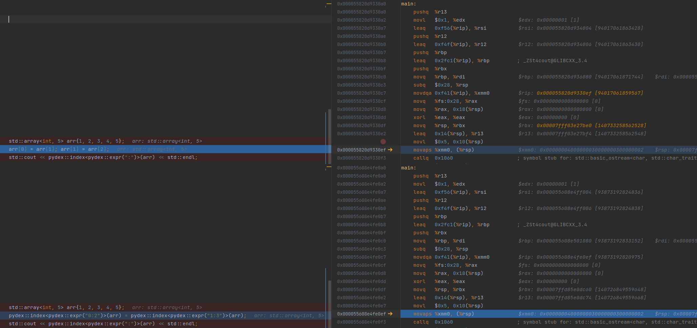

# Pydex
Compile time pythonic indexing for C++20

Usage:
See example.cpp

<h1> 
Pydexability: 
</h1>

Any type that satisfies this concept
```cpp
template<typename T> concept Pydexable = requires(T x) { x[x.size()]; };
```
is usable with `pydex::index`, slices returned by `pydex::index` are also pydexable.

<h1>
Supported:
</h1>

Constant indexing:
```cpp
auto& x = pydex::index<"1,2,3,-4">(arr); // x = arr[1,2,3,-4]
```

Constant slicing:
```cpp
auto& x = pydex::index<"1:3, 3, :, -5:">(arr); // x = arr[1:3, 3, :, -5:]
// Prints arr[1, 3, 3, -5:]
std::cout << x[0][3] << std::endl;
```

Steps:
```cpp
auto& x = pydex::index<"::2">(arr); // Every other element in arr
```

Ellipsis:
```cpp
auto& x = pydex::index<"..., 3">(arr); // arr[..., 3]
```

Assignment:
```cpp
pydex::index<"1,2,3,-4">(arr) = 5; // arr[1,2,3,-4] = 5
pydex::index<"0:3">(arr) = {3,4,5}; // arr[0:3] = [3,4,5]
```
Assigning to a slice from another slice where both slices share the underlying container 
and have overlapping elements is not safe if an element gets overwritten in the LHS slice before it is read in the RHS slice, e.g:
```cpp
std::vector<int> vec{1, 2, 3, 4, 5};
pydex::index<"1:3">(vec) = pydex::index<"0:2">(vec); // Unsafe
// should print [1, 1, 2, 4, 5], actually prints [1, 1, 1, 4, 5]
std::cout << pydex::index<":">(vec) << std::endl; 
```
```cpp
std::vector<int> vec2{1, 2, 3, 4, 5};
pydex::index<"0:2">(vec2) = pydex::index<"1:3")>(vec2); // Safe
// prints [2, 3, 3, 4, 5]
std::cout << pydex::index<":">(vec2) << std::endl;
```
`std::ostream` integration:
```cpp
std::cout << pydex::index<":, 3">(arr) << std::endl; // print(arr[:, 3])
```

<h1> Unsupported </h1>

Variable slicing:
```python
x = arr[a:b] #unsupported
```

<h1> No runtime overhead</h1>

